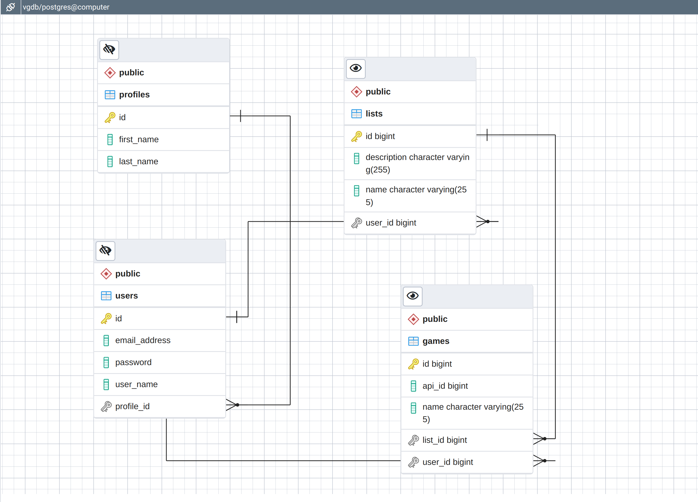

<div id="top"></div>

[![Contributors][contributors-shield]][contributors-url]
[![Forks][forks-shield]][forks-url]
[![Stargazers][stars-shield]][stars-url]
[![Issues][issues-shield]][issues-url]
[![LinkedIn][linkedin-shield]][linkedin-url]


<h2 align="center">International Video Game Registry</h2>
<h3 align="center">Front End</h3>

  <p align="center">
    International Video Game Registry - A Digital Library of Game Information for Players. Players can create an account, search search the RAWG data base api by title, view the game listing, and add it to their personal CRUD list of game titles.
    <br />
    <a href="https://github.com/Kieran815/vg-registry"><strong>Explore the docs »</strong></a>
    <br />
    <br />
    <a href="https://github.com/Kieran815/vg-registry">View Demo</a>
    ·
    <a href="https://github.com/Kieran815/vg-registry/issues">Report Bug</a>
    ·
    <a href="https://github.com/Kieran815/vg-registry/issues">Request Feature</a>
  </p>
</div>


<!-- TABLE OF CONTENTS -->
<details>
  <summary>Table of Contents</summary>
  <ol>
    <li>
      <a href="#about-the-project">About The Project</a>
      <ul>
        <li><a href="#built-with">Built With</a></li>
      </ul>
    </li>
    <li>
      <a href="#getting-started">Getting Started</a>
      <ul>
        <li><a href="#prerequisites">Prerequisites</a></li>
        <li><a href="#installation">Installation</a></li>
      </ul>
    </li>
    <li><a href="#usage">Usage</a></li>
    <li><a href="#roadmap">Roadmap</a></li>
    <li><a href="#contributing">Contributing</a></li>
    <li><a href="#license">License</a></li>
    <li><a href="#contact">Contact</a></li>
    <li><a href="#acknowledgments">Acknowledgments</a></li>
  </ol>
</details>


<!-- ABOUT THE PROJECT -->
## About The Project

<p align="right">(<a href="#top">back to top</a>)</p>


### Built With

* [Angular](https://angular.io/)
* [Bootstrap](https://valor-software.com/ngx-bootstrap/#/)
* [Spring Boot](https://spring.io/projects/spring-boot)
* [RAWG API](https://rawg.io/login?forward=developer)

<p align="right">(<a href="#top">back to top</a>)</p>


<!-- GETTING STARTED -->
## Getting Started

### Prerequisites

This is an example of how to list things you need to use the software and how to install them.
* npm
  ```sh
  npm install npm@latest -g
  ```

### Installation

1. Get a free API Key at [RAWG API](https://rawg.io/login?forward=developer)
2. Clone the repo
   ```sh
   git clone https://github.com/Kieran815/vg-registry.git
   ```
3. Install NPM packages
   ```sh
   npm install
   ```
4. Enter your API in `app/_services/list.service.ts`
   ```js
   rawgKey: string = 'ENTER YOUR API';
   ```

<p align="right">(<a href="#top">back to top</a>)</p>


<!-- USAGE EXAMPLES -->
## Usage

A Digital Library of Game Information for Players. Players can create an account, search search the RAWG data base api by title, view the game listing, and add it to their personal CRUD list of game titles.

_For more examples, please refer to the [Documentation](https://github.com/Kieran815/vg-registry)_

<p align="right">(<a href="#top">back to top</a>)</p>


<!-- ROADMAP -->
## Roadmap

[Project Requirements](https://git.generalassemb.ly/java-interapt-11-8/capstone-project)

### Deliverables

**User Stories**
As a User, I should be able to:
- [x] log in to my account
- [x] get a list of games
  - [x] by title
- [x] Select a game to view the details
- [x] add the selected game to my list
- [x] View My List
  - [x] Delete Game from My List

**Stretch Goals**
- [ ] add a news feed about upcoming games

### Entity Relationship Diagram


<!-- See the [open issues](https://github.com/Kieran815/vg-registry/issues) for a full list of proposed features (and known issues). -->

<p align="right">(<a href="#top">back to top</a>)</p>


<!-- CONTRIBUTING -->
## Contributing

Contributions are what make the open source community such an amazing place to learn, inspire, and create. Any contributions you make are **greatly appreciated**.

If you have a suggestion that would make this better, please fork the repo and create a pull request. You can also simply open an issue with the tag "enhancement".
Don't forget to give the project a star! Thanks again!

1. Fork the Project
2. Create your Feature Branch (`git checkout -b feature/AmazingFeature`)
3. Commit your Changes (`git commit -m 'Add some AmazingFeature'`)
4. Push to the Branch (`git push origin feature/AmazingFeature`)
5. Open a Pull Request

<p align="right">(<a href="#top">back to top</a>)</p>


<!-- LICENSE -->
## License

Distributed under the MIT License.

<p align="right">(<a href="#top">back to top</a>)</p>


<!-- CONTACT -->
## Contact

**Email** - <a href="mailto: kieran.milligan@gmail.com">kieran.milligan@gmail.com</a><br/>
**Portfolio** - <a href="kmilligan.info" target="_blank" rel="noopener noreferrer">kmilligan.info</a><br/>
<!-- **Twitter** - [@twitter_handle](https://twitter.com/twitter_handle) -->

Project Links:
<br/>
[Kieran815/vg-registry](https://github.com/Kieran815/vg-registry)<br/>
[Kieran815/vg-backend](https://github.com/Kieran815/vg-backend)
<p align="right">(<a href="#top">back to top</a>)</p>


<!-- ACKNOWLEDGMENTS -->
## Acknowledgments

* []() David Magbee
* []() Usman Bashir
* []() Suresh Sugera

<p align="right">(<a href="#top">back to top</a>)</p>

[contributors-shield]: https://img.shields.io/github/contributors/Kieran815/vg-registry.svg?style=for-the-badge
[contributors-url]: https://github.com/Kieran815/vg-registry/graphs/contributors
[forks-shield]: https://img.shields.io/github/forks/Kieran815/vg-registry.svg?style=for-the-badge
[forks-url]: https://github.com/Kieran815/vg-registry/network/members
[stars-shield]: https://img.shields.io/github/stars/Kieran815/vg-registry.svg?style=for-the-badge
[stars-url]: https://github.com/Kieran815/vg-registry/stargazers
[issues-shield]: https://img.shields.io/github/issues/Kieran815/vg-registry.svg?style=for-the-badge
[issues-url]: https://github.com/Kieran815/vg-registry/issues
[license-shield]: https://img.shields.io/github/license/Kieran815/vg-registry.svg?style=for-the-badge
[license-url]: https://github.com/Kieran815/vg-registry/blob/master/LICENSE.txt
[linkedin-shield]: https://img.shields.io/badge/-LinkedIn-black.svg?style=for-the-badge&logo=linkedin&colorB=555
[linkedin-url]: https://linkedin.com/in/kieran-milligan
[product-screenshot]: images/screenshot.png
